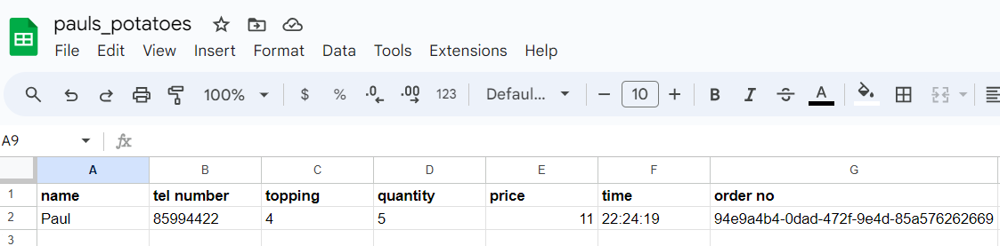
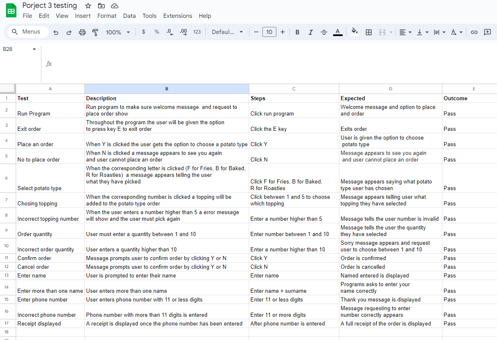

# Overview

Paul's Potaoes is a potato based food truck in the heart of Westport. The food truck lets the user pick from 3 types of potato
fries, baked or roasties. The user then picks from a range of 5 toppings to add over their potato choice. This users order
is then transferred to a google sheet.

## User experience

### Goals

- The program should be easy to navigate
- The steps which appear should be relevant to the information
- Instructions should be easy for the user guide them through each step
- Each option choosen by the user should have the correct next step and follow up message
- The program should access the right datasheet for all data in the orders sheet
- The program should update the datasheet with the right values

### User Goals

- I want to easily navigate my way through the programme to select my order
- I want to follow a chronological order that makes sense to order 
- Display what the keys are for each step and let me know if I enter something incorrect
- I want to know the prices of each order
- I want to know the type of potato I choose and the type of toppings
- I want the option of restarting my order in case I want to change my order
- I want to receive a receipt of what I ordered

### Owner Goals

- I want a clear and easy to understand way of ordering online
- I want the spreadsheet to be clear and easy to read.

## Design

Flow chart to be added

## Features

### Greeting

- When the program is run the user receives a welcome message and the option to place an order

### Menu

- The user is prompted to choose which type of potato they would like, fries, baked or roasties by entering the corresponding letter

- The potato option will also show the price for each option.

- Once the letter is entered the program will display a message of what type of potato chosen the user is given the option to pick what 
  topping they would like between 5 options. The user chooses the option by selected the corresponding number ot each option

- Once the user chooses the topping option a message will display what topping they choose

### Quantity

- When the user has choosen their potato type and topping they will get the option to choose 
  a quantity between 1 and 10. Ad it is a food truck the orders cannot exceed 10

- The user will then need to click Y to confirm the order or N to to restart the order

### User name

- The user will then be prompted to enter there name. The name must not have any spaces

- Once the name is enter a message will display the name the user entered

### Phone number

- The user will then be prompted to enter their phone number. The phone number must be no longer than 11 digits

### Order confirmation

- An order confirmation message will appear sating your order has been processed and gives a time 
  on when it will be ready

### Receipt

- Once the order is confirmed a receipt will be shown to the customer with the address of Paul's Potatoes,
  the order number and time of the order

### Google sheet

- The order info is added to the google sheet as seen below

## Technologies

- Python to write my programme
- JavaScript provided in the Code Institute template
- CSS provided in the Code Institute template
- HTML provided in the Code Institute template
- Google sheets to store the information
- Heroku to deploy the project

### Python Libraries

- Datetime to add the time to the receipt and spreadsheet of when the order was placed
- UUID to generate a random code to use as an order number
- Sys to allow the user to exit the function
- Gspread to link my google sheet for the owner to see the data of the orders

## Testing

### Functions

A list of testing can be seen below

