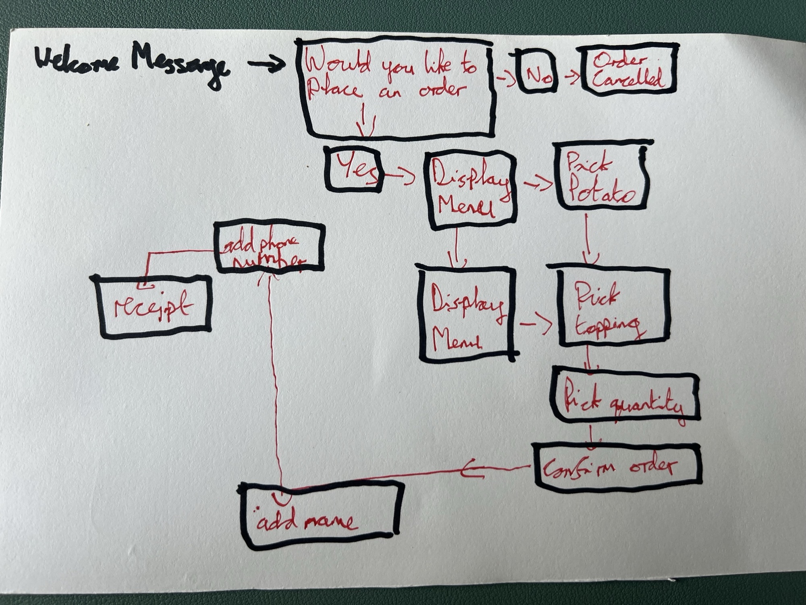
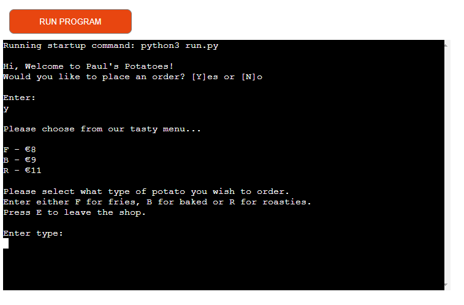
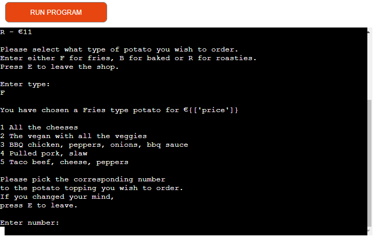
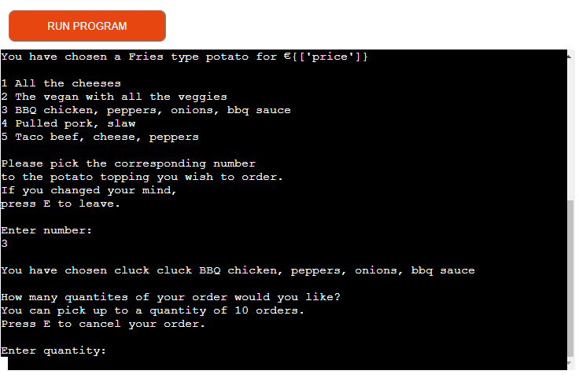
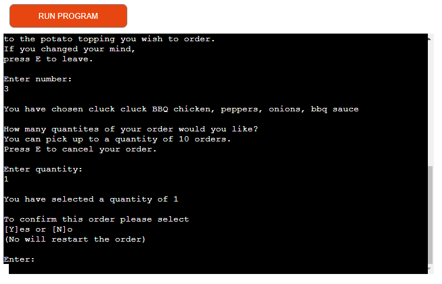
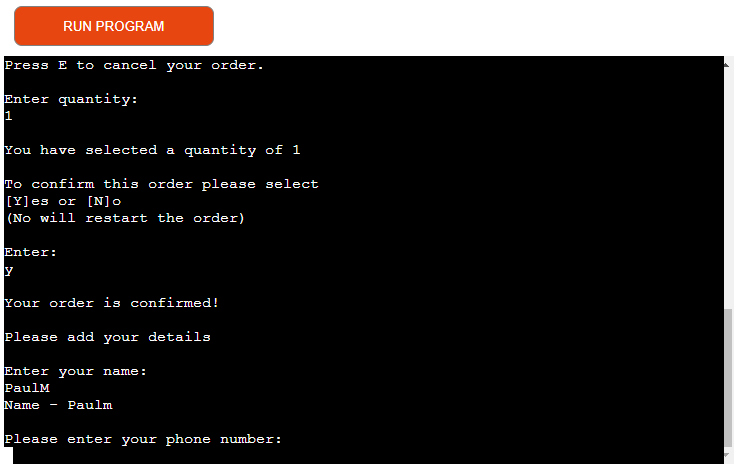
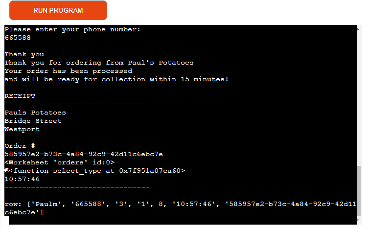
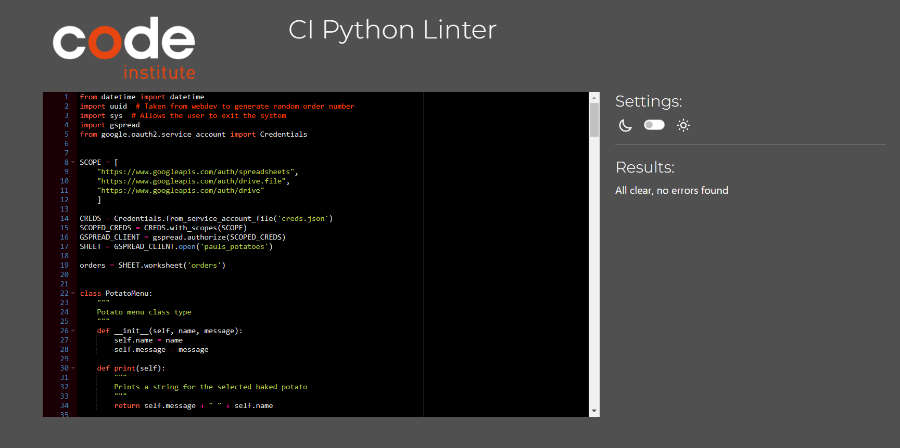

# Overview

Paul's Potaoes is a potato based food truck in the heart of Westport. The food truck lets the user pick from 3 types of potato
fries, baked or roasties. The user then picks from a range of 5 toppings to add over their potato choice. This users order
is then transferred to a google sheet

### Links

- Website https://pauls-potatoes-a84274d78adf.herokuapp.com/

- Google spreadsheet - https://docs.google.com/spreadsheets/d/1rW_2AhjOC0qPToSOdbb-RrZAfiR9R1AlcWi2h_NHc8I/edit#gid=0

## User experience

### Goals

- The program should be easy to navigate
- The steps which appear should be relevant to the information
- Instructions should be easy for the user guide them through each step
- Each option choosen by the user should have the correct next step and follow up message
- The program should access the right datasheet for all data in the orders sheet
- The program should update the datasheet with the right values

### User Goals

- I want to easily navigate my way through the programme to select my order
- I want to follow a chronological order that makes sense to order 
- Display what the keys are for each step and let me know if I enter something incorrect
- I want to know the prices of each order
- I want to know the type of potato I choose and the type of toppings
- I want the option of restarting my order in case I want to change my order
- I want to receive a receipt of what I ordered

### Owner Goals

- I want a clear and easy to understand way of ordering online
- I want the spreadsheet to be clear and easy to read.

## Design

- Flow chart sketch

## Features

### Greeting

- When the program is run the user receives a welcome message and the option to place an order

### Menu

- The user is prompted to choose which type of potato they would like, fries, baked or roasties by entering the corresponding letter

- The potato option will also show the price for each option.

- Once the letter is entered the program will display a message of what type of potato chosen the user is given the option to pick what 
  topping they would like between 5 options. The user chooses the option by selected the corresponding number ot each option

- Once the user chooses the topping option a message will display what topping they choose

### Quantity

- When the user has choosen their potato type and topping they will get the option to choose 
  a quantity between 1 and 10. Ad it is a food truck the orders cannot exceed 10

- The user will then need to click Y to confirm the order or N to to restart the order

### User name

- The user will then be prompted to enter there name. The name must not have any spaces

- Once the name is enter a message will display the name the user entered

### Phone number

- The user will then be prompted to enter their phone number. The phone number must be no longer than 11 digits

### Order confirmation

- An order confirmation message will appear sating your order has been processed and gives a time 
  on when it will be ready

### Receipt

- Once the order is confirmed a receipt will be shown to the customer with the address of Paul's Potatoes,
  the order number and time of the order

  

### Google sheet

- The order info is added to the google sheet as seen below

## Technologies

- Python to write my programme
- JavaScript provided in the Code Institute template
- CSS provided in the Code Institute template
- HTML provided in the Code Institute template
- Google sheets to store the information
- Heroku to deploy the project

### Python Libraries

- Datetime to add the time to the receipt and spreadsheet of when the order was placed
- UUID to generate a random code to use as an order number
- Sys to allow the user to exit the function
- Gspread to link my google sheet for the owner to see the data of the orders

## Testing

### Functions

- A list of function testing can be seen below

The following was tested to make sure code would run profiently:

- Passed the code through a PEP8 linter
- Tested in my local terminal and the Code Institute Heroku terminal

## Deployment

The project was created using vs code and gitpod

### Deploy from Github

- Log into your GitHub repository
- Click 'Settings' in the main Repository menu
- Click 'Pages' from the left-hand side navigation menu
- click the "Branch" button and change from 'None' to 'Main'
- The page should automatically refresh with a url displayed
- Test the link by clicking on the url

### Create the google spreadsheet

Login to your Google account, create an account if necessary
Navigate to Sheets, Googles version of Microsoft Excel
Start a new spreadsheet, amend the title at the top i.e., pauls_potatoes
Create 1 Sheet titling it 'orders'

### API setup

- Open Google cloud platform and sign in
- From the google cloud platform dashboard click Select a new project. Then select new project
- Create a name for your project then click Create
- There should be a box with selct project, click this
- From the sidebar navigate to APIs and services, library
- In the search bar search for google drive
- Select Google drive API and click enable
- Click the create credentials button in the top of the page
- From the dropdown menu under which API are you using? select Google drive API
- Under what data will you be accessing choose application data
- Under are you planning to use this API with Compute Engine, Kubernetes Engine, App Engine or Cloud Functions?' select 'No, i'm not using them and click next
- Enter a service account name. Naming it the same as what you named your project  is suggested. Then click created and continue
- In the role dropdown menu select basic, editor then click continue
- The next page can be left blank so just click done
- Under service accounts find the account you just created and click it
- Find the keys tab and click add key, create new key. Select JSON and click create
- This will download a json file to your machine
- Link the Google Sheets API. Navigate back to the library by clicking on the burger icon in the top left hand corner and selecting APIs and services, library from the dropdown menu
- In the search bar search for Google Sheets and select Google Sheets API' and click enable
- Open or create a repository
- Drag and drop the json file that you downloaded earlier into your workspace. Rename this file to creds.json
- Open the file and copy the email address under client_email without the quotation marks
- Open the google sheet you want to use and click the share
- Paste in the client email. Make sure editor is selected, untick notify people and then click share
- To protect sensitive information be sure to add your creds.json file to your .gitignore file inside your editor
- In order to use our google sheets API you need to install two additional dependencies into your project.
- Copy the following code on the first two lines of your workspace

### Heroku

- The requirements.txt file in the IDE must be updated to package all dependencies. To do this:

- Enter the following into the terminal: 'pip3 freeze > requirements.txt'
- Commit the changes and push to GitHub
- Sign in to heroku

- On the heroku dashboard click the create new app button

- Name the app something unique and choose what region you are in then click create app

- Go to the settings tab and the config ars section. Click reveal config vars

- In the field for KEY enter the value CREDS in all capitals

- In the field for VALUE copy and paste the entire contents of your creds.json file from your project. Then click add

- In the field for KEY enter PORT in all capitals, then in the field for VALUE enter 8000. Then click add

- Scroll down to the Buildpacks section and click add buildpack

- Click Python then save changes

- Add another buildpack by clicking add buildpack and this time click Nodejs then save changes

- Make sure that Python appears above Nodejs in the buildpack section. If it does not you can click and drag them to change the order

- Go to the deploy section by clicking deploy from the nav bar at the top of the page

- On the deployment method section select GitHub and click connect to GitHub

- Enter the repository name as it is in GitHub and click search

- Click the connect button next to the repository to link it to heroku

- To deploy, scroll down and click the deploy branch button

- Heroku will notify you that the app was successfully deployed with a button to view the app

## Bugs

- When prompted to enter the potato quantity, if the user enters a string it will give an error message
  instead of prompting the user to enter a number between 1 and 10.

## Credits

- Code Institues project 3 run through love sandwiches

- Stackoverflow for tips on for the user to exit order

- Webdev used to generate random order number
